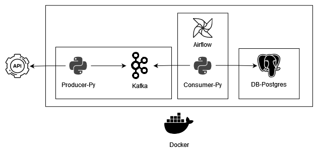

# Nombre del Proyecto

Descripción breve del proyecto.

## Arquitectura



Este proyecto utiliza una arquitectura basada en microservicios con un flujo de trabajo de procesamiento de datos en tiempo real. A continuación se describe cada componente:

### Productor-Py

- **Descripción**: Microservicio encargado de producir datos desde una API y enviarlos a Kafka.
- **Tecnologías**: Python.

### Kafka

- **Descripción**: Sistema de mensajería distribuido que maneja el flujo de datos entre productores y consumidores.
- **Tecnologías**: Apache Kafka.

### Airflow-Consumidor-Py

- **Descripción**: Microservicio que consume los datos de Kafka y los procesa según la lógica de negocio.
- **Tecnologías**: Python, Apache Airflow para la orquestación de tareas.

### DB-Postgres

- **Descripción**: Base de datos donde se almacenan los datos procesados.
- **Tecnologías**: PostgreSQL.

### Docker

- **Descripción**: Utilizado para contenerizar y gestionar los servicios de manera aislada.

## Inicio Rápido

Instrucciones para comenzar a utilizar el proyecto:

```bash
# Clonar el repositorio
git clone [URL_DEL_REPOSITORIO]

# Exec script de inicialización
./sh init.sh
```
