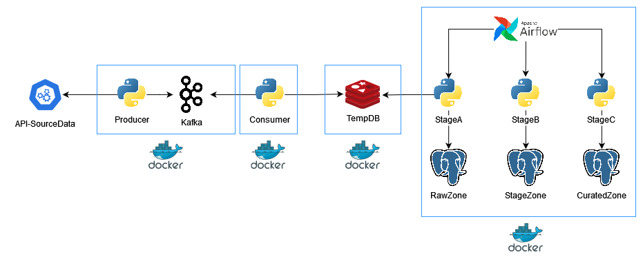

# Nombre del Proyecto

Breve descripción del proyecto, su propósito y alcance.

## Arquitectura

### Componentes

- **API**: Punto de entrada para los datos, expone una interfaz REST para la ingesta de datos.
- **Producer**: Módulo Python (`Producer-Py`) que recopila datos de la API.
- **Consumer**: Módulo Python (`Consumer-Py`) que consume los datos proporcionados por el `Producer`.
- **Redis**: Sistema de almacenamiento en memoria que actúa como base de datos temporal (`TempDB`) para los datos consumidos.
- **Airflow**: Orquestador de flujos de trabajo que gestiona y automatiza los procesos de tratamiento de datos.
  - **LANDING**: Primera capa de procesamiento donde los datos aterrizan desde `Redis`.
  - **RAW**: Capa de datos crudos donde se almacenan los datos sin procesar.
  - **STG**: Capa de 'staging' o ensayo, que sirve como área intermedia para el procesamiento de datos.
  - **CUR**: Capa actual, donde los datos están listos para ser utilizados por aplicaciones finales.
- **DB-Postgres**: Base de datos PostgreSQL que almacena datos en las diferentes capas (`LANDING`, `RAW`, `STG`, `CUR`).

## Instalación

### Requisitos

### Configuración

## Uso

## Contribuir

Guía para desarrolladores interesados en contribuir al proyecto.

## Licencia

Detalles sobre la licencia del proyecto.
